# Data Model — Book Recommendation Hub

Derived from `web-app-design-system/` (the unzipped Claude Design export) —
specifically `uploads/book_recommendation_hub_project_brief.pdf` (the product
brief) and the mock data baked into `Prototype with Admin.dc.html` (which is
more detailed than the brief: it adds review/account moderation, book-request
approval, and a safeguarding queue with a 14-day soft-delete trash).

## Entities at a glance

- **User** — a reader account. Holds the onboarding **Survey** (genre/level/
  length preferences) that drives recommendations.
- **Book** — pulled from an external API (Google Books / Open Library), not
  hand-maintained.
- **Review** — a 1–5 star rating + text, public, moderated (auto-filter +
  reports).
- **ReadingStatus** — the association between a user and a book: which of the
  three default buckets (Want to Read / Currently Reading / Read) it's in,
  plus a self-reported progress step.
- **ReadingList** — a user's custom, nameable, public/private list of books
  (independent of ReadingStatus).
- **Report** — a flag a user raises on a review *or* directly on another user,
  tagged with a `type` (rude / spam / off-topic / bad language / safety
  concern). Routine types feed the normal review-moderation queue; the
  `safety_concern` type feeds a separate, higher-priority safeguarding queue
  — same table, different queue by type, not two tables.
- **BookRequest** — "add this missing book" submission; admin approves
  (imports from the API) or declines (with a reason). One data model powers
  both the reader's "books you've asked for" screen and the admin queue.
- **TrashItem** — soft-deleted reviews/accounts/requests, recoverable for 14
  days before permanent removal.

## Class diagram

```mermaid
classDiagram
    class User {
        +string id
        +string email
        +string passwordHash
        +string displayName
        +string avatarColor
        +bool emailVerified
        +bool isAdmin
        +bool isBanned
        +date joinedAt
        +resetPassword()
    }

    class Survey {
        +List~string~ genres
        +string readingLevel
        +string preferredLength
        +date updatedAt
    }

    class Book {
        +string id
        +string title
        +string author
        +int pages
        +string readingLevel
        +List~string~ genres
        +string coverUrl
        +string summary
        +bool isSeries
        +string sourceApi
    }

    class Review {
        +string id
        +int stars
        +string text
        +date postedAt
        +string moderationStatus
        +string autoFlagReason
        +edit()
    }

    class ReadingStatus {
        +string status
        +string progressStep
        +date updatedAt
    }

    class ReadingList {
        +string id
        +string name
        +bool isPublic
        +string shareSlug
        +int sortOrder
    }

    class Report {
        +string id
        +string type
        +string targetType
        +string targetId
        +string text
        +string status
        +date reportedAt
    }

    class BookRequest {
        +string id
        +string title
        +string author
        +string status
        +string declineReason
    }

    class TrashItem {
        +string id
        +string kind
        +string name
        +date deletedAt
        +int daysLeft
        +restore()
    }

    User "1" *-- "1" Survey : completes at onboarding
    User "1" --> "*" Review : writes
    Book "1" --> "*" Review : has
    User "1" --> "*" ReadingList : owns
    ReadingList "*" --> "*" Book : contains
    User "1" -- "*" ReadingStatus : tracks
    Book "1" -- "*" ReadingStatus : tracked as
    User "1" --> "*" Report : files
    Report "*" --> "0..1" Review : targets
    Report "*" --> "0..1" User : targets
    User "1" --> "*" BookRequest : submits
    BookRequest "*" --> "*" User : also requested by
    User "1" --> "0..1" TrashItem : soft-deleted as
    Review "1" --> "0..1" TrashItem : soft-deleted as
    BookRequest "1" --> "0..1" TrashItem : soft-deleted as
```

## Notes / open modeling questions

- **ReadingStatus** is an association class on `(User, Book)` — a user marks
  a book Want to Read / Currently Reading / Read from the book detail page,
  independent of whether that same book also sits in one of their custom
  `ReadingList`s.
- **Report** is now a single table for both routine moderation reports and
  safeguarding concerns, distinguished by `type`. It targets either a Review
  or a User directly ("the reader kofi_a"), hence the loose `targetType` /
  `targetId` pair rather than a hard foreign key to one class. Admin UI reads
  this as two different queues — `WHERE type = 'safety_concern'` for
  safeguarding, everything else for the normal review queue — so the "never
  buried behind spam reports" guarantee from the design now has to be
  enforced by that query/index rather than by physical table separation.
- **TrashItem** is a generic soft-delete envelope (`kind`: Review / Account /
  Request) rather than one table per entity — matches the single "Trash"
  admin screen with a shared 14-day countdown.
- The brief (v2) explicitly scoped moderation *out* of v1 ("no automated
  moderation queue yet"), but the admin `.dc.html` prototypes clearly design
  for it (auto-block word filter, report reasons, safeguarding queue) — this
  diagram follows the more detailed, later prototype rather than the brief
  where they disagree.
